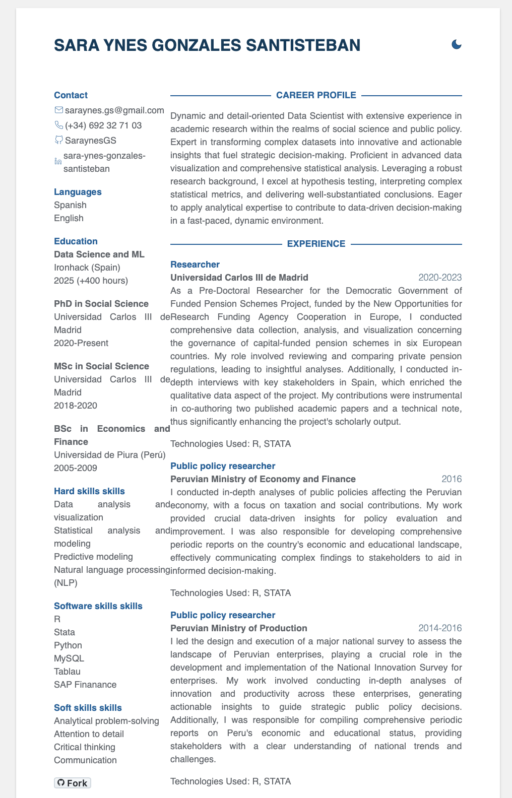

Social Scientist in love with Data Science, with a background in Economics. Over the last five years, I've been studying private pensions in Europe as part of a project at Carlos III de Madrid University. Under this project, I have co-authored two published papers with my PhD Advisor, Juan J. Fernández.

Read my CV: https://saraynesgs.github.io/cv-saraynesgs/

- Follow CV jekyll theme. Demo [here](https://jekyll-cv.stavrospanakakis.com/).
Go to https://username.github.io/jekyll-cv/

## Preview

